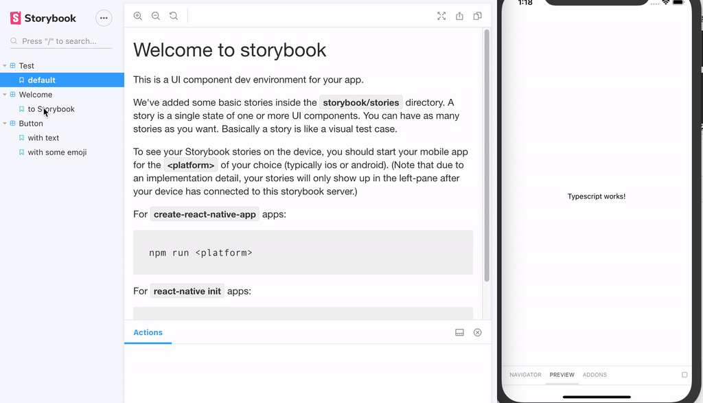

# React native Storybook

Storybook for react native is a RN View component that can be embedded anywhere in your RN
application, e.g. on a tab or within an admin screen. Storybook can be run in two ways:

- by setting STORYBOOK_RUN=1 environment variable. (This variable will be picked up by
  react-native-config package from .env.storybook file.)
- by toggling storybook mode in react-native in-app developer menu

## Running storybook

Storybook for IOS: `yarn storybook:ios`

Storybook for Android: `yarn storybook:android`

## Web integration

React native storybook has an optional way to navigate storybook on the emulators or devices by
running a web server with websocket connection to emulators.

Disclaimer: Currently there is a small issue with one of the packages
https://github.com/storybookjs/react-native/issues/13, when it will be solved we will be able to use
web integration.

Running storybook with web integration:

- `yarn storybook`
- `yarn storybook:ios` or `yarn storybook:android` Open http://localhost:7007 if it didn't open
  browser automatically. Navigate through the Storybook UI in the tab opened in our browser and see
  how it switches stories on emulator.
